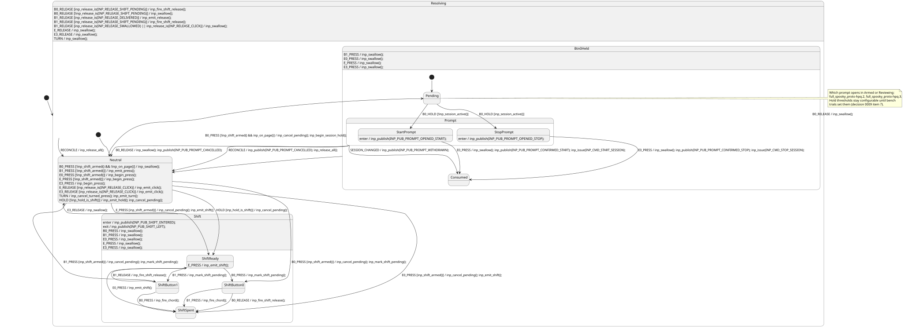

# Behavior model

This folder is the authoritative behavior model of the M7 application: what the device
does in each state, which commands and service events it accepts, and which facts it
publishes. It refines the [modes and interaction](../../../spec/product/modes-and-interaction.md)
product intent and the [application model](../architecture.md#application-model). If
this model conflicts with product intent or the constitution, the higher source wins
and the conflict is reported, not resolved here.

The model is a set of hierarchical state machines, one per region. States nest and
transitions may form cycles. The [top-level chart](top-level.md) shows the whole device
and how the regions run side by side. Following
[decision 0006](../../decisions/0006-statesmith-behavior-model.md), each region is a
StateSmith PlantUML diagram from which the firmware is generated. Regions move to
diagrams one at a time, in the order InputResolution, Session, Radio, Context; a
region's Markdown file is deleted in the change that lands its diagram.

## Files

| File | Region | Form |
|---|---|---|
| [InputResolutionSm.puml](InputResolutionSm.puml) ([rendered](InputResolutionSm.svg)) | InputResolution: the Button 0 session hold and prompt ([decision 0005](../../decisions/0005-button-0-session-prompt.md)) | StateSmith diagram |
| [top-level.md](top-level.md) | Device chart, parallel regions, the Context region, cross-region invariants | Tables |
| [session.md](session.md) | Session: recording lifecycle | Tables |
| [radio.md](radio.md) | Radio: tuning, band transitions and radio faults | Tables |
| [presentation.md](presentation.md) | How domain events and published state reach the user | Hand-written contract |

Each diagram generates `CM7/App/sm/<Name>Sm.c` and `.h`, and the rendered
`<Name>Sm.svg` beside it. Generated files are committed and never edited by hand; see
[behavior-model regeneration](../repository-layout.md#behavior-model-regeneration).

## What gets a state machine

Not everything with a value is a state machine. A region or state exists only where
being in it changes which transitions are legal or how a command or input is
interpreted. Session is a region because a tune command is rejected while recording.

Values that do not change legality are **model data**: published state that commands
read and write, but that owns no transitions. Examples: band, frequency, scan position,
scan rate, EMF level, radio activity, selected parameter page, battery level. A value
can have a machine around the process that changes it while staying data itself: the
band is data, and a band transition in progress may be a state.

## Vocabulary

| Term | Meaning | Example |
|---|---|---|
| Input event | Behavior-neutral report from the input subsystem: press, release, encoder detents, with sequence and time | Encoder 0 +2 detents |
| Command | A request for a product-level operation, from gesture resolution or the CLI | StartSession |
| Service event | A timer, subsystem completion, failure or other occurrence that may drive a machine | BlockWritten, CaptureFault |
| State | A condition that remains true for some duration and affects behavior | Recording |
| Guard | A condition that must hold for a transition to occur | card_present |
| Invariant | A condition that must remain true while a state is active | Tune commands do not execute while recording |
| Action | Authoritative work performed because of a transition | Open session file |
| Domain event | A one-shot fact published by the authoritative model, including rejections and failures | RecordingStarted, RecordingRejected |
| Presentation | How published state and domain events are expressed to the user | Record LED, OLED text, audio cue |

The flow is always the same. Input events pass through gesture resolution and become
commands; the CLI produces commands directly, through the same command handling. A
machine receives commands and service events, checks guards, performs actions, changes
state and publishes domain events. Presentation renders published state and domain
events and never feeds back into the machine.

## StateSmith diagrams

**What a diagram owns.** The diagram is authoritative for states, hierarchy, events,
guards, actions and transitions. It describes implemented behavior and claims nothing
about proof.

**Where other facts live.**

- Proven behavior is recorded in [`docs/evidence/`](../../evidence/). Host tests are not
  hardware evidence.
- Open behavior is a Beads issue. A diagram may point to it with a `note` naming the
  issue; StateSmith ignores notes and PlantUML comments.
- Target behavior that differs from the firmware lives in its decision record and
  Beads task, and the diagram changes in the change that implements it. A safety guard
  still in force is drawn as a guard, with a note citing its record.
- A machine's invariants are assertions in its host tests. Invariants that span regions
  are stated in [top-level.md](top-level.md#invariants).
- Diagrams have no row IDs, maturity, deviation or retired-ID tables. Tests are named
  for the behavior they check.
- [presentation.md](presentation.md) maps the diagrams' published events to surfaces,
  using the names the diagrams publish.

**The port.** Each machine has a hand-written port beside the generated files,
`CM7/App/sm/<region>_port.h` and `.c`. The port is the machine's only interface:

- a narrow service interface that the application calls, one function per event;
- the guards and actions the diagram calls, which are the only functions a diagram may
  call, so no HAL call, service internal or global appears in a diagram;
- integration functions the port calls, which the firmware wiring or a host test
  provides.

**Diagram rules.**

1. The `@startuml` name matches the file name and ends in `Sm`. The diagram does not
   set `outputDirectory`; the regeneration script places the files. It sets
   `IncludeGuardLabel` to `SPOOKY_<REGION>_SM_H` and includes its port header through
   `CFileIncludes`.
2. Every state is declared inside its parent before any transition refers to it
   (StateSmith issue 460). Initial transitions of a composite state are written
   inside it.
3. Actions are C statements and end with a semicolon. StateSmith copies them verbatim.
4. An event a state does not handle falls through to its parent. A transition ends the
   dispatch, so a child's transition overrides its parent's for the same event.
5. Every non-transition behavior whose guard holds runs, one after another. Behaviors
   of one state that share a trigger therefore have mutually exclusive guards, and a
   guard must give the same answer before and after the actions of the behaviors
   before it. Ports evaluate such guards from a classification taken before dispatch.
6. A behavior that must not run exit and entry actions is written as a behavior of the
   state (`State : EVENT / action();`), not as a self-transition.
7. Machines never dispatch into one another synchronously. Commands and cross-region
   events pass through a bounded M7 event queue (`full_spooky_proto-8lw.13`).
   Cross-region guards such as `in(Session.Active)` read another machine's state
   through the port.

Host tests compile generated machines with `spooky_generated_sm()` in
`tests/CMakeLists.txt`, drive them through the real port against a fake integration,
and assert the machine's invariants, including over seeded random input sequences.

## Regions in table form

Regions that have not yet moved to a diagram are specified as Markdown tables. These
conventions apply to those files only.

- **Stable IDs.** Every state, invariant and transition has an ID with its machine's
  prefix: `SES-S1` for a state, `SES-I1` for an invariant, `SES-01` for a transition.
  IDs are never reused or renumbered. When a row's meaning changes, it gets a new ID
  and the old ID moves to the file's Retired IDs table.
- **Tables are authoritative.** Mermaid diagrams illustrate the tables and must not
  show a transition, state or trigger that the tables lack.
- **Diagrams render in Mermaid 11.** VS Code's preview uses Mermaid 11, which fails
  on a composite state nested inside a parallel region. Draw such a state as a simple
  state with a description, and keep its substates in the tables.
- **One row per outcome.** Rows with the same source state and trigger have mutually
  exclusive guards, so exactly one row applies. When a synchronous action can fail,
  each result gets its own row, and the guard names the result. The guard table says
  whether a guard is evaluated before the actions or after a named action.
- **Commands are answered.** Every command a region can receive has a row, or an
  Open behavior entry, in every state of that region. Rejections are rows too. A
  service event without a row in the current state is ignored.
- **Cross-region conditions** are written `in(Region.State)`, for example
  `in(Session.Active)`.
- **Composite states.** A transition from a composite state applies in every state
  nested inside it.
- **Returning to a previous context** is specified as observable behavior: the entering
  transition saves the context and the leaving transition restores it. Diagrams may
  annotate this as deep history to explain the semantics. The model does not require
  the firmware to implement a history pseudostate or any other particular technique.
- **Open behavior.** A semantic table holds only settled behavior. A Target row traces
  to the constitution, product intent, an accepted decision record, an explicit user
  direction recorded in a Beads issue, or existing firmware behavior. Anything else
  goes in the file's **Open behavior** table as a question, with the Beads issue or
  product open decision that settles it.
- **Maturity** describes confidence in a row, not machine behavior, and lives in a
  separate **Maturity** table keyed by ID. Proven rows link to bench evidence; Target
  rows name their source and the state of the implementation. A host-tested row stays
  Target until a bench run proves it. A **deviation** is a place where current firmware
  behaves differently from the model, listed with the Beads bug that tracks it.
