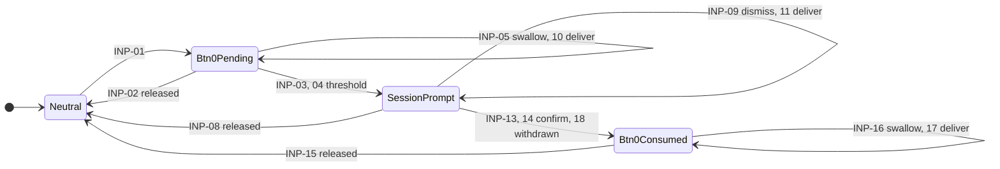

# InputResolution region

How behavior-neutral input events become commands. Conventions are in the
[model README](README.md); prefix `INP`. This file models the first slice only: the
Button 0 hold that starts and stops sessions, control-map bindings
[C-090 to C-093](../../../spec/product/control-map.md#bindings). The Shift layer, other
holds, chords and selectors are open under `full_spooky_proto-54w.2`.

Constitution: Principle I (stopping a session needs explicit confirmation), Principle II
(feedback follows outcomes), Principle III (inputs arrive without meaning, gesture
resolution is on the M7, and no control stays latched), Principle IV (timings stay
configurable). Decision: [0005](../../decisions/0005-button-0-session-prompt.md).

## Diagram

INP-12, input reconciliation, returns every state to Neutral and is not drawn.

## States

| ID | State | Meaning |
|---|---|---|
| INP-S1 | Neutral | No Button 0 session hold is in progress. Other gestures resolve normally. |
| INP-S2 | Btn0Pending | Button 0 is held and the session hold threshold has not been reached |
| INP-S3 | SessionPrompt | The start or stop prompt is open and Button 0 is still held |
| INP-S4 | Btn0Consumed | The prompt has closed without being cancelled, and Button 0 is still held |

## Invariants

| ID | While | Invariant |
|---|---|---|
| INP-I1 | Every state | A release is interpreted in the context where its press began. A release whose press was swallowed or dismissed is swallowed too. |
| INP-I2 | Every state | A restart, overflow or staleness in input reporting releases every held control, so none stays latched ([DEV-I2](top-level.md#invariants)) |
| INP-I4 | Btn0Pending, SessionPrompt, Btn0Consumed | The only commands issued are StartSession and StopSession from INP-13 and INP-14 |

## Input and service events

| Name | Kind | Meaning |
|---|---|---|
| Btn0Pressed, Btn0Released | Input event | Debounced Button 0 transitions |
| Enc0Pressed | Input event | Debounced Encoder 0 button press |
| Other input event | Input event | Any other press, release or encoder detent, and any hold or chord gesture that would resolve from them |
| HoldThresholdReached | Service event | Button 0 has been held for the session hold threshold |
| SessionStateChanged | Service event | The Session region changed state, for example because a session started from the CLI or ended on its own |
| InputReconcile | Service event | Input reporting restarted, overflowed or went stale, and all controls are treated as released |

## Guards

| Guard | Evaluated | Holds when |
|---|---|---|
| shift_held | Before actions | The Shift layer was active when Button 0 went down |
| pre_held_release | Before actions | The event is the release of a control that was already held when Button 0 went down |
| prompt_start, prompt_stop | Before actions | The open prompt is a start prompt, or a stop prompt |

## Transitions

| ID | From | Trigger | Guard | Actions | To | Publishes |
|---|---|---|---|---|---|---|
| INP-01 | Neutral | Btn0Pressed | not shift_held, `in(Context.Operating)` | Start the session hold timer | Btn0Pending | None |
| INP-02 | Btn0Pending | Btn0Released | None | Cancel the timer | Neutral | None |
| INP-03 | Btn0Pending | HoldThresholdReached | `in(Session.Idle)` | Open the start prompt | SessionPrompt | SessionPromptOpened(start) |
| INP-04 | Btn0Pending | HoldThresholdReached | `in(Session.Active)` | Open the stop prompt | SessionPrompt | SessionPromptOpened(stop) |
| INP-05 | Btn0Pending | Other input event | not pre_held_release | Swallow it | Btn0Pending | None |
| INP-08 | SessionPrompt | Btn0Released | None | Close the prompt | Neutral | SessionPromptCancelled |
| INP-09 | SessionPrompt | Other input event | not pre_held_release | Dismiss it | SessionPrompt | None |
| INP-10 | Btn0Pending | Other input event | pre_held_release | Deliver the release to the context where its press began | Btn0Pending | As that context defines |
| INP-11 | SessionPrompt | Other input event | pre_held_release | Deliver the release to the context where its press began | SessionPrompt | As that context defines |
| INP-13 | SessionPrompt | Enc0Pressed | prompt_start | Close the prompt; issue StartSession | Btn0Consumed | SessionPromptConfirmed(start) |
| INP-14 | SessionPrompt | Enc0Pressed | prompt_stop | Close the prompt; issue StopSession | Btn0Consumed | SessionPromptConfirmed(stop) |
| INP-15 | Btn0Consumed | Btn0Released | None | None | Neutral | None |
| INP-16 | Btn0Consumed | Other input event | not pre_held_release | Swallow it | Btn0Consumed | None |
| INP-17 | Btn0Consumed | Other input event | pre_held_release | Deliver the release to the context where its press began | Btn0Consumed | As that context defines |
| INP-18 | SessionPrompt | SessionStateChanged | None | Close the prompt without issuing a command | Btn0Consumed | SessionPromptWithdrawn |
| INP-12 | Every state | InputReconcile | None | Close any prompt without issuing a command; release all held controls | Neutral | SessionPromptCancelled, if a prompt was open |

A confirmed prompt issues its command through the shared command policy. The session's
own domain events, not SessionPromptConfirmed, decide whether the start or stop
succeeded.

## Cross-region effects

| Row | Effect |
|---|---|
| INP-13, INP-14 | Issue [StartSession or StopSession](session.md#commands-and-service-events) |
| INP-18 | Any Session state change while the prompt is open withdraws it |
| INP-03, INP-04 | The prompt kind follows the Session state when the threshold is reached |
| DEV-I2 | Input reconciliation is the device-wide release-all rule |

## Open behavior

| From | Trigger | Question | Settled by |
|---|---|---|---|
| Btn0Pending | HoldThresholdReached | Which prompt, if any, opens while Session is Armed or Reviewing? | `full_spooky_proto-hpq.2`, `full_spooky_proto-hpq.3` |
| Neutral | Btn0Pressed outside `Context.Operating` | Does the session hold work in utility spaces such as Settings and Playback? | `full_spooky_proto-54w.2` |
| Neutral | Btn0Pressed with shift_held | Shift plus Button 0 switches operating mode; the Shift layer is not modelled yet | `full_spooky_proto-54w.2` |
| Btn0Pending | Session hold threshold | How long is the hold? It stays configurable until bench trials set it. | `full_spooky_proto-54w.2`, control-map D-006 |
| Any | Rest of the region | Shift layer, holds, chords, selectors and their precedence | `full_spooky_proto-54w.2` |

## Maturity

| ID | Status | Basis |
|---|---|---|
| INP-S4 | Target | [Decision 0005](../../decisions/0005-button-0-session-prompt.md), item 5 |
| INP-S1 to INP-S3 | Target | User direction 2026-09-27, recorded in `full_spooky_proto-54w.18`. Not implemented. |
| INP-I1 | Target | Product intent: [State Ownership](../../../spec/product/modes-and-interaction.md#state-ownership-and-software-boundary), each press resolves in the context where it began |
| INP-I2 | Target | Constitution Principle III |
| INP-I4 | Target | [Decision 0005](../../decisions/0005-button-0-session-prompt.md) |
| INP-01 to INP-05, INP-08, INP-09 | Target | User direction 2026-09-27, `full_spooky_proto-54w.18`. Not implemented. |
| INP-13 to INP-16, INP-18 | Target | [Decision 0005](../../decisions/0005-button-0-session-prompt.md), items 4 to 6. Not implemented. |
| INP-10, INP-11, INP-17 | Target | Constitution Principle III: a release that is not delivered would leave its control latched |
| INP-12 | Target | Constitution Principle III |

## Retired IDs

| ID | Meaning | Replaced by |
|---|---|---|
| INP-I3 | Only INP-06 and INP-07 issue commands while Button 0 is held | INP-I4, which adds Btn0Consumed |
| INP-06 | Confirming a start prompt returned to Neutral | INP-13, which goes to Btn0Consumed |
| INP-07 | Confirming a stop prompt returned to Neutral | INP-14, which goes to Btn0Consumed |
