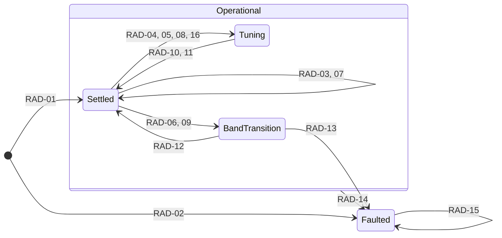

# Radio region

Receiver control and the radio audio stream that feeds the recorder and the monitored
mix. Conventions are in the [model README](README.md); prefix `RAD`. Today the region
is driven by the `TUNE`, `UP`, `DOWN` and `BAND` commands of the
[USB CLI](../usb-cli.md#radio); scan engines and physical controls will issue the same
commands.

Constitution: Principle II (a published frequency is a completed result, and
consequential transitions have explicit outcomes), Principle III (one owner for the
receiver and its bus), Principle IV (bounded transitions), Principle VI (today's
recording guard stays until qualified), Principle VII (structured tune targets).
Decisions: [0003](../../decisions/0003-radio-control-during-recording.md) and
[0004](../../decisions/0004-radio-track-continuity-across-transitions.md).

Radio state says whether the receiver is settled, busy with a transition, or out of
service. Band, frequency, signal quality and each band's last frequency are model data
that the states carry, not states of their own.

## Diagram

## States

| ID | State | Meaning |
|---|---|---|
| RAD-S1 | Operational | Composite of Settled, Tuning and BandTransition: the receiver is powered and radio audio is flowing or about to resume |
| RAD-S2 | Settled | The receiver is tuned, its digital output runs, and the stream gate is open |
| RAD-S3 | Tuning | An in-band tune was issued and its completion is pending. Receiver audio keeps flowing. |
| RAD-S4 | BandTransition | The receiver is being power-cycled into a band, and the stream gate is closed |
| RAD-S5 | Faulted | No radio audio. The receiver is held in reset and the monitored output is muted |

## Invariants

| ID | While | Invariant |
|---|---|---|
| RAD-I1 | Every state | Session state never makes a radio command legal or illegal ([SES-I4](session.md#invariants)) |
| RAD-I2 | Operational | The published band and frequency are the last completed result the receiver reported, never a requested target |
| RAD-I3 | BandTransition | No receiver audio reaches the recorder or the monitored mix. Each gated radio half-buffer reaches the recorder as digital silence of the same length. |
| RAD-I4 | Faulted | The receiver stays in reset and the monitored output stays muted. Only a system reset leaves Faulted. |
| RAD-I5 | Every state | Every radio command completes, fails or is rejected within a bounded time that fits the recorder's queue budget |
| RAD-I6 | Every state | The radio control service is the only user of I2C1, the receiver reset line and the antenna switch |

## Commands and service events

| Name | Kind | Meaning |
|---|---|---|
| Tune(frequency) | Command | Tune within the current band. CLI form `TUNE <kHz>`. FM is rounded to the receiver's 10 kHz command unit. |
| TuneStep(direction, edge) | Command | Move one band step up or down. `edge` says what happens at the band edge in that direction: `stop` stays there, `wrap` moves to the opposite edge. CLI forms `UP` and `DOWN`, which use `stop`. |
| SwitchBand(band) | Command | Change to a band and restore that band's last frequency. CLI form `BAND FM\|AM\|SW\|LW`. |
| TuneTarget(band, frequency) | Command | A structured tune target from a scan engine. The region decides whether it needs an in-band tune or a band transition. |
| TuneComplete(status) | Service event | The receiver reported tune completion with band, frequency, RSSI, SNR and valid-channel flag |
| TuneFailed(reason) | Service event | A tune could not complete: bus error, or no completion within the device timeout |
| BandTransitionComplete(status) | Service event | Power-up, tune and digital-output restart all succeeded |
| BandTransitionFailed(reason) | Service event | Muting, power-cycling, tuning or unmuting failed during a band transition |
| AudioFault(flags) | Service event | The radio SAI or DMA reported an error, or the codec output or volume path failed |

Read-only queries, `STATUS` and `BAND` without an argument, report published state and
change nothing. CLI syntax errors are answered by the CLI and never reach the machine.

## Guards

| Guard | Evaluated | Holds when |
|---|---|---|
| start_ok | After the start actions | Audio path, codec, radio capture, receiver start and monitor start all succeeded |
| in_range | Before actions | The frequency lies within the limits of the band it targets |
| same_band | Before actions | A TuneTarget's band is the current band |
| at_edge | Before actions | The current frequency equals the band limit in the step direction |

## Transitions

| ID | From | Trigger | Guard | Actions | To | Publishes |
|---|---|---|---|---|---|---|
| RAD-01 | Initial | Boot | start_ok | Start radio capture; reset and power up the receiver in FM; tune the FM default; enable digital output; start the monitor | Settled | RadioStarted(status) |
| RAD-02 | Initial | Boot | not start_ok | Mute the codec; hold the receiver in reset | Faulted | RadioFault(start) |
| RAD-03 | Settled | Tune(frequency) | not in_range | None | Settled | TuneRejected(out of range) |
| RAD-04 | Settled | Tune(frequency) | in_range | Issue the tune | Tuning | TuneStarted(target) |
| RAD-05 | Settled | TuneStep(direction, edge) | edge is `stop`, or not at_edge | Target the current frequency plus or minus one band step, clamped to the band edges; issue the tune | Tuning | TuneStarted(target) |
| RAD-06 | Settled | SwitchBand(band) | None | Mute the monitor; close the stream gate; stop digital output; power down; select the band's antenna path; power up in the band; tune the band's last frequency; restart digital output | BandTransition | BandTransitionStarted(from, to) |
| RAD-07 | Settled | TuneTarget(band, frequency) | not in_range | None | Settled | TuneRejected(out of range) |
| RAD-08 | Settled | TuneTarget(band, frequency) | in_range, same_band | Issue the tune | Tuning | TuneStarted(target) |
| RAD-09 | Settled | TuneTarget(band, frequency) | in_range, not same_band | As RAD-06, tuning the target frequency instead of the band's last frequency | BandTransition | BandTransitionStarted(from, to) |
| RAD-10 | Tuning | TuneComplete(status) | None | Publish the status; remember the frequency as the band's last | Settled | Tuned(status) |
| RAD-11 | Tuning | TuneFailed(reason) | None | Record a tune fault; keep the last completed status | Settled | TuneFailed(target, reason) |
| RAD-12 | BandTransition | BandTransitionComplete(status) | None | Open the stream gate; unmute the monitor; publish the status; remember the frequency as the band's last | Settled | BandChanged(status) |
| RAD-13 | BandTransition | BandTransitionFailed(reason) | None | Keep the stream gate closed; mute the codec; hold the receiver in reset; mark the audio path stopped | Faulted | RadioFault(band transition, reason) |
| RAD-14 | Operational | AudioFault(flags) | None | Mute the codec; mark the audio path stopped | Faulted | RadioFault(audio, flags) |
| RAD-15 | Faulted | Tune, TuneStep, SwitchBand or TuneTarget | None | None | Faulted | RadioCommandRejected(radio unavailable) |
| RAD-16 | Settled | TuneStep(direction, edge) | edge is `wrap`, at_edge | Target the opposite edge of the band; issue the tune | Tuning | TuneStarted(target) |

## Band transition sequence

The actions of RAD-06 as the current firmware performs them, in order. Every receiver
command waits for the device to be ready before and after it is sent, and each of those
waits may last up to 2 s. The fixed delays add up to 71 ms; the typical total duration
has never been measured.

| Step | Action | Fixed delay | Waits per step |
|---|---|---|---|
| 1 | Mute the codec over I2C4 and close the stream gate | None | Codec bus time, not examined |
| 2 | Set the receiver's digital output rate to zero | 10 ms | Two device waits |
| 3 | Power down the receiver | 1 ms | Two device waits |
| 4 | Select the antenna path for the band | None | None |
| 5 | Power up the receiver in the band's function with digital output | None | Two device waits |
| 6 | Set reference clock, prescaler, volume and hard-mute properties | 10 ms after each of four properties | Two device waits per property |
| 7 | Tune the band's last frequency, then poll for completion every 2 ms | 2 ms between polls | Completion within 2 s, plus two device waits per poll |
| 8 | Set digital output rate and format | 10 ms after each of two properties | Two device waits per property |
| 9 | Open the stream gate and unmute the codec | None | Codec bus time, not examined |

## Published radio state

| Field | Meaning |
|---|---|
| Radio state | Settled, Tuning, BandTransition or Faulted |
| Band | Current band |
| Frequency, RSSI, SNR, valid | The last completed tune result |
| Target | The most recently requested frequency |
| Last frequency per band | Restored by SwitchBand |
| Last fault | None, start, tune or band transition |

## Cross-region effects

| Row | Effect |
|---|---|
| SES-I4 | Radio commands are legal in every Session state |
| SES-14 | A radio SAI or DMA error during a session is also a session CaptureFault |
| SES-I5 | During BandTransition the recorder receives silence and the session events mark the gap |
| SES-01 | The session guard radio_running fails while the region is Faulted, so no session can start |

## Open behavior

| From | Trigger | Question | Settled by |
|---|---|---|---|
| Tuning | Tune, TuneStep, TuneTarget | Does a new target replace the pending one, wait for it, or get rejected? The answer sets the maximum scan rate. | `full_spooky_proto-54w.6` |
| BandTransition | Any radio command | Is it deferred until the transition ends, replaced by the latest, or rejected? | `full_spooky_proto-54w.12` |
| Tuning, BandTransition | Worst-case duration | How long do tunes and band transitions take in the worst case, and do they fit the queue budget, or must the service become non-blocking? | `full_spooky_proto-54w.6`, `full_spooky_proto-54w.12` |
| Settled | TuneStep | Which controls and engines step with `wrap`, and which with `stop`? | `full_spooky_proto-54w.2`, `full_spooky_proto-54w.7` |
| Settled | TuneStep or scan at a band edge | Should scanning continue into the adjacent band instead of stopping or wrapping? This is interband traversal, deferred until basic scanning is proven. | `full_spooky_proto-54w.17` |
| Settled | SwitchBand to the current band | Power-cycle the receiver as today, or treat the command as a no-op? | `full_spooky_proto-54w.12` |
| Settled | After RAD-11 | Should the published frequency be marked uncertain, since the receiver may have stopped partway? | `full_spooky_proto-54w.6` |
| Faulted | Recovery | Can the radio recover without a system reset, and does an active session continue while it is Faulted? | `full_spooky_proto-54w.12` |
| BandTransition | Bus time | How much I2C1 and I2C4 time does a transition take from the foreground loop? | `full_spooky_proto-54w.12` |
| Any | Event timestamps | Where on the session sample timeline do TuneStarted, Tuned and band-transition events fall? | `full_spooky_proto-hpq.1` |
| Any | Acknowledgement | How are BandChanged and RadioFault acknowledged on display, lights and audio? | `full_spooky_proto-54w.1` |

## Maturity

| ID | Status | Basis |
|---|---|---|
| RAD-S1 to RAD-S4 | Proven | [Radio regression](../../evidence/2026-09-24-radio-regression.md) |
| RAD-S5 | Target | Implemented; no bench evidence |
| RAD-I1 | Target | [SES-I4](session.md#maturity) basis; decision 0003 |
| RAD-I2 | Target | Implemented: the tune status changes only on completion. Constitution Principle II. |
| RAD-I3 | Target | Decision 0004 |
| RAD-I4 | Target | Implemented; no bench evidence |
| RAD-I5 | Target | Constitution Principle IV; decision 0003 |
| RAD-I6 | Target | Constitution Principle III. Implemented: I2C1 is used only by the radio control service. |
| RAD-01 | Proven | [Radio regression](../../evidence/2026-09-24-radio-regression.md), boot log |
| RAD-02 | Target | Implemented; no bench evidence |
| RAD-03 | Proven | [Radio regression](../../evidence/2026-09-24-radio-regression.md), `tune 108004` |
| RAD-04 | Proven | [Radio regression](../../evidence/2026-09-24-radio-regression.md), `tune 101504` rounds to 101500 kHz |
| RAD-05 | Proven | [Radio regression](../../evidence/2026-09-24-radio-regression.md), `up` clamps at 108000 kHz, `down` steps |
| RAD-06 | Proven | [Radio regression](../../evidence/2026-09-24-radio-regression.md), all four bands and last-frequency restore |
| RAD-07 | Target | Product intent: [Field Mode purpose](../../../spec/product/modes-and-interaction.md#purpose-1), structured tune targets. No firmware. |
| RAD-08 | Target | Same basis as RAD-07 |
| RAD-09 | Target | Same basis as RAD-07 |
| RAD-10 | Proven | [Radio regression](../../evidence/2026-09-24-radio-regression.md) |
| RAD-11 | Target | Implemented; no bench evidence |
| RAD-12 | Proven | [Radio regression](../../evidence/2026-09-24-radio-regression.md) |
| RAD-13 | Target | Implemented; no bench evidence |
| RAD-14 | Target | Implemented; no bench evidence |
| RAD-15 | Target | Implemented; no bench evidence |
| RAD-16 | Target | User direction 2026-09-27, recorded in `full_spooky_proto-54w.7`. Not implemented. |

## Deviations

| Row | Firmware today | Tracked by |
|---|---|---|
| RAD-I1 | Tune, band, `UP` and `DOWN` are rejected during a recording. Principle VI keeps this guard until qualification passes. | `full_spooky_proto-54w.6`, `full_spooky_proto-54w.12` |
| RAD-I3 | The stream gate drops radio half-buffers instead of passing silence to the recorder | `full_spooky_proto-54w.12` |
| RAD-I5 | Tunes and band transitions block the foreground loop until they finish. Each device wait may last up to 2 s, and each property write adds 10 ms. | `full_spooky_proto-54w.6` |
| RAD-03 to RAD-15 | Domain events exist only as CLI replies and log lines. TuneStarted and BandTransitionStarted are not published at all, and a failed tune reply gives no reason. | `full_spooky_proto-54w.4` |
