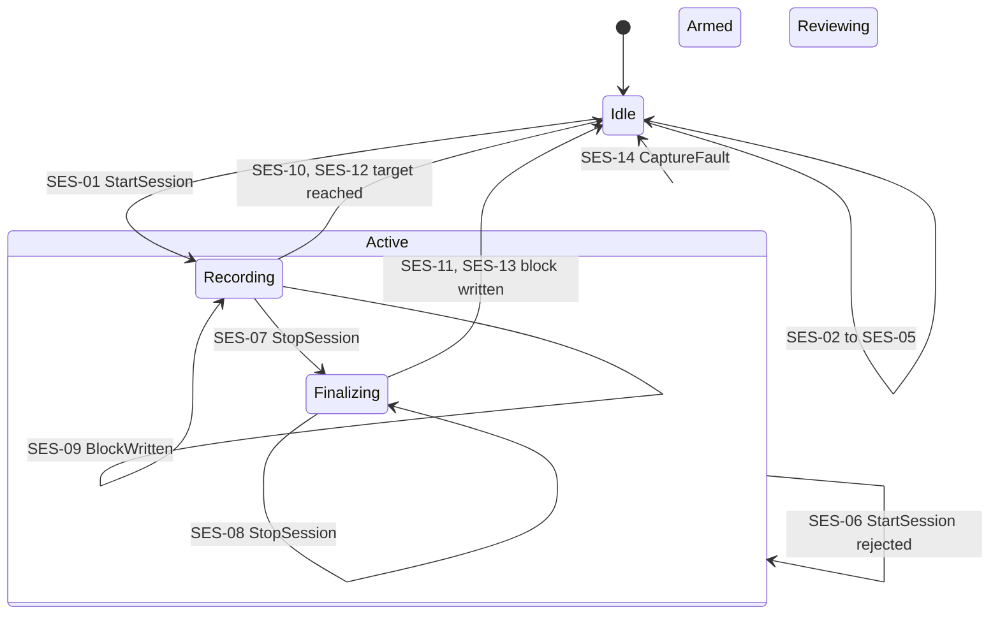

# Session region

The recording lifecycle. Conventions are in the [model README](README.md); prefix
`SES`. Today the lifecycle is driven by the `RECORD` commands of the
[USB CLI](../usb-cli.md#recording); physical controls will issue the same commands.

Constitution: Principle I (recording is a promise; failures are visible and partial
data is finalized), Principle II (explicit outcomes), Principle VI (today's tune and band
guard stays until a bench test proves the workload safe while recording).

Session state says only whether a recording lifecycle is active. It makes no claim
about who owns the SD card: an SD test or a WAV transfer can hold the card while the
session is Idle. Storage arbitration belongs to the M2 storage service and appears here
only as the guard `card_free`.

## Diagram

Armed and Reviewing are named by the constitution. Their transitions are open, so none
are drawn.

## States

| ID | State | Meaning |
|---|---|---|
| SES-S1 | Idle | No recording lifecycle is active |
| SES-S2 | Active | Composite of Recording and Finalizing: a session file is open and capture is running |
| SES-S3 | Recording | Radio and microphone audio are captured and written to the session file |
| SES-S4 | Finalizing | A stop was requested. Capture continues until the next matched radio and microphone block is written, then the file is closed |
| SES-S5 | Armed | Rolling capture is running and nothing is committed to a session |
| SES-S6 | Reviewing | A saved session is being played back |

## Invariants

| ID | While | Invariant |
|---|---|---|
| SES-I2 | Active | SD maintenance and WAV transfer commands do not execute; they are rejected with a reason |
| SES-I3 | Active | Radio and microphone audio are written only as matched block pairs, so the tracks stay in sync |
| SES-I4 | Every state | Session state never makes a radio command illegal. Tune, tune-step and band commands are handled the same in every Session state. |
| SES-I5 | Active | The radio track keeps its timeline through receiver transitions. Each radio half-buffer held back during a transition is written as digital silence of the same length, and the gap's start and end are published with their sample positions. |

## Commands and service events

| Name | Kind | Meaning |
|---|---|---|
| StartSession(duration) | Command | Start a session of up to `duration` seconds. The CLI form is `RECORD START [seconds]`. |
| StopSession | Command | End the session cleanly. The CLI form is `RECORD STOP`. |
| BlockWritten | Service event | One matched radio and microphone block was written to the file |
| CaptureFault(reason) | Service event | The card was removed, a radio or PDM DMA error occurred, a radio or PDM queue overran, or a block write failed |

## Guards

| Guard | Evaluated | Holds when |
|---|---|---|
| can_start | Before actions | All of: card_present, card_free, radio_running, pdm_ready, duration_valid |
| card_present | Before actions | The card-detect switch reports a card |
| card_free | Before actions | No SD test holds the card. A WAV transfer accepts no other command, so it cannot overlap. |
| radio_running | Before actions | The radio audio path is running |
| pdm_ready | Before actions | The PDM microphone filter exists and is not in an error state |
| duration_valid | Before actions | The duration is 1 to 3600 seconds |
| file_opened | After Open session file | Mount, file naming, creation, preallocation and header write all succeeded |
| capture_started | After Start capture | PDM DMA started |
| target_reached | Before actions | The written audio has reached the requested duration, or the next block would exceed the WAV size limit |
| finalize_ok | After Finalize file | The WAV header was patched and the file closed |

## Transitions

| ID | From | Trigger | Guard | Actions | To | Publishes |
|---|---|---|---|---|---|---|
| SES-01 | Idle | StartSession | can_start, file_opened, capture_started | Open session file; start capture | Recording | RecordingStarted(file, duration) |
| SES-02 | Idle | StartSession | not can_start | None | Idle | RecordingRejected(reason) |
| SES-03 | Idle | StartSession | can_start, not file_opened | Open session file; delete any partial file | Idle | RecordingRejected(reason) |
| SES-04 | Idle | StartSession | can_start, file_opened, not capture_started | Open session file; start capture; finalize file | Idle | RecordingAborted(reason, finalized) |
| SES-05 | Idle | StopSession | None | None | Idle | StopIgnored |
| SES-06 | Active | StartSession | None | None | Active, unchanged | RecordingRejected(already active) |
| SES-07 | Recording | StopSession | None | Request stop at the next matched block | Finalizing | RecordingStopping |
| SES-08 | Finalizing | StopSession | None | None | Finalizing | RecordingStopping |
| SES-09 | Recording | BlockWritten | not target_reached | None | Recording | None |
| SES-10 | Recording | BlockWritten | target_reached, finalize_ok | Stop capture; finalize file | Idle | RecordingCompleted(file, reason) |
| SES-11 | Finalizing | BlockWritten | finalize_ok | Stop capture; finalize file | Idle | RecordingCompleted(file, reason) |
| SES-12 | Recording | BlockWritten | target_reached, not finalize_ok | Stop capture; finalize file | Idle | RecordingAborted(reason, finalized) |
| SES-13 | Finalizing | BlockWritten | not finalize_ok | Stop capture; finalize file | Idle | RecordingAborted(reason, finalized) |
| SES-14 | Active | CaptureFault(reason) | None | Stop capture; finalize file | Idle | RecordingAborted(reason, finalized) |

`RecordingAborted` always reports whether the partial file was finalized, so a failed
session is never shown as a successful one.

## Cross-region effects

| Row | Effect |
|---|---|
| DEV-01 | EnterSleep is allowed only `in(Session.Idle)` |
| DEV-I1 | Context transitions never change Session state |
| SES-I4 | Radio commands are legal in every Session state; the [Radio region](radio.md)'s own rules decide whether one is deferred or rejected |

## Open behavior

| From | Trigger | Question | Settled by |
|---|---|---|---|
| Idle | Physical start | What duration does a physical start request? The gesture itself is the Button 0 session hold in [input-resolution.md](input-resolution.md). | `full_spooky_proto-54w.1` |
| Active | Commands from other regions | Which are allowed, deferred or rejected while recording, and how is each acknowledged? | `full_spooky_proto-54w.1` |
| Active | Tune, band | What must hold before today's guard is removed: stream continuity, timing against the queue budget, scan rate, raw-track semantics, event timestamps, failure isolation, acknowledgement and bus contention? | [Decision 0003](../../decisions/0003-radio-control-during-recording.md); `full_spooky_proto-54w.6`, `full_spooky_proto-54w.12` |
| Active | Radio fault | Does a failed tune or band switch end the session, or publish a radio fault while capture continues? | `full_spooky_proto-54w.12` |
| Idle, Armed | Rolling capture start, save and stop | How long is the window, where do its buffers live, and how is a save committed? | `full_spooky_proto-hpq.2` |
| Idle | Enter review | Is Reviewing a Session state entered while the Playback utility is open, or only a Context concern? The constitution lists reviewing as a session state; product intent makes Playback a utility space. | `full_spooky_proto-hpq.3` |
| Idle | StartSession | What replaces the single `REC###.WAV` file with a session folder and manifest? | `full_spooky_proto-hpq.3` |

## Maturity

| ID | Status | Basis |
|---|---|---|
| SES-S1 | Proven | [Ten-minute baseline](../../evidence/2026-09-26-ten-minute-recording-baseline.md) |
| SES-S2 | Proven | [Ten-minute baseline](../../evidence/2026-09-26-ten-minute-recording-baseline.md) |
| SES-S3 | Proven | [Ten-minute baseline](../../evidence/2026-09-26-ten-minute-recording-baseline.md) |
| SES-S4 | Target | Implemented; reached only through `RECORD STOP`, which has no bench evidence |
| SES-S5 | Target | Constitution Principle II names the state; its behavior is open |
| SES-S6 | Target | Constitution Principle II names the state; its placement is open |
| SES-I2 | Target | Implemented; no bench evidence |
| SES-I3 | Proven | [Recording regression REC018](../../evidence/2026-09-26-recording-regression-live-rec018.md), loopback alignment |
| SES-I4 | Target | Product intent: [roadmap](../../../spec/product/roadmap.md) M3 scope, in-band tuning while recording, and M4 scope, band transitions qualified during recording; [Modes and interaction](../../../spec/product/modes-and-interaction.md#field-sessions), Field Sessions; [decision 0003](../../decisions/0003-radio-control-during-recording.md) |
| SES-I5 | Target | [Decision 0004](../../decisions/0004-radio-track-continuity-across-transitions.md); [Modes and interaction](../../../spec/product/modes-and-interaction.md#field-sessions), Field Sessions |
| SES-01 | Proven | [Ten-minute baseline](../../evidence/2026-09-26-ten-minute-recording-baseline.md), [recording regression REC018](../../evidence/2026-09-26-recording-regression-live-rec018.md) |
| SES-02 | Target | Implemented; no bench evidence of the rejections |
| SES-03 | Target | Implemented; no bench evidence |
| SES-04 | Target | Implemented; no bench evidence |
| SES-05 | Target | Implemented; no bench evidence |
| SES-06 | Target | Implemented; no bench evidence |
| SES-07 | Target | Implemented; no bench evidence of `RECORD STOP` |
| SES-08 | Target | Implemented; no bench evidence |
| SES-09 | Proven | [Ten-minute baseline](../../evidence/2026-09-26-ten-minute-recording-baseline.md) |
| SES-10 | Proven | [Ten-minute baseline](../../evidence/2026-09-26-ten-minute-recording-baseline.md), [recording regression REC018](../../evidence/2026-09-26-recording-regression-live-rec018.md) |
| SES-11 | Target | Implemented; no bench evidence |
| SES-12 | Target | Implemented; no bench evidence |
| SES-13 | Target | Implemented; no bench evidence |
| SES-14 | Target | Implemented; card removal and full-card cases are M1 gates in `full_spooky_proto-jjy` |

## Deviations

| Row | Firmware today | Tracked by |
|---|---|---|
| SES-I4 | Tune, band, `UP` and `DOWN` are rejected while Active with `ERR RADIO tuning disabled while recording`, shown in the [radio regression](../../evidence/2026-09-24-radio-regression.md). Principle VI keeps this guard until bench qualification passes. | `full_spooky_proto-54w.6`, `full_spooky_proto-54w.12` |
| SES-I5 | The band-switch stream gate drops radio half-buffers instead of passing silence. Unreachable during a session today, because the SES-I4 guard rejects band changes while recording. | `full_spooky_proto-54w.12` |
| DEV-01 guard | EnterSleep is accepted during a session, and the recording is finalized and reported as a pass | `full_spooky_proto-8lw.11` |
| All `SES` rows | Domain events exist only as CLI reply lines; nothing is published to presentation surfaces | `full_spooky_proto-54w.4` |

## Retired IDs

| ID | Meaning | Replaced by |
|---|---|---|
| SES-I1 | Tune and band commands are rejected while Active | SES-I4; today's rejection is listed as a deviation |
