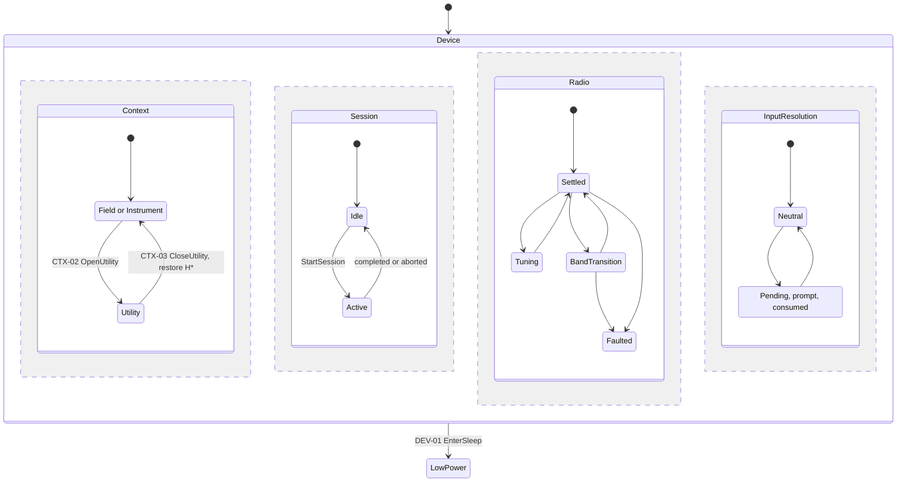

# Top-level chart

The whole device as one composite state with parallel regions, plus the low-power
state that leaves it. Conventions are in the [model README](README.md). Prefixes:
`DEV` for device-level rows, `CTX` for the Context region.

Constitution: Principle I (navigation never interrupts a session), Principle III
(single authority, release-all on input loss), Principle VII (Field and Instrument as
the two operating modes; utilities return to the previous context).

## Diagram

`H*` marks deep history: CTX-03 restores the operating context that CTX-02 saved.
Operating is drawn as one state because Mermaid 11 cannot draw a composite state inside
a parallel region. Its Field and Instrument substates are in the States table; the
transitions between them are open. The Session, Radio and
InputResolution regions are summarized; their machines are in [SessionSm.puml](SessionSm.puml),
[radio.md](radio.md) and [InputResolutionSm.puml](InputResolutionSm.puml).

## Regions

A region exists only where its state changes which transitions are legal or how
commands and inputs are interpreted.

| Region | Question it answers | Why it is a region | Detail |
|---|---|---|---|
| Context | Which operating mode, engine, view or utility has the controls | It decides what a resolved gesture means | This file |
| Session | Whether a recording lifecycle is active | Active sessions reject SD maintenance and WAV transfer, and change how stop and faults are handled | [SessionSm.puml](SessionSm.puml) |
| Radio | Whether a band or tuning transition is in progress | Commands arriving mid-transition need defined handling | [radio.md](radio.md) |
| InputResolution | How held controls, Shift and chords are being interpreted | The same press means different things while Shift is held or a chord is pending | [InputResolutionSm.puml](InputResolutionSm.puml), Button 0 session hold only; the rest is open in `full_spooky_proto-54w.2` |

Shift is part of InputResolution, not a peer of Session or Context: it changes how
inputs resolve into commands, not what the product is doing.

Field engines, Instrument engines and performance views are substates of Operating.
This chart does not model them; the list is in the product
[mode hierarchy](../../../spec/product/modes-and-interaction.md#mode-hierarchy).

## States

| ID | State | Meaning |
|---|---|---|
| DEV-S1 | Device | The normal application is running |
| DEV-S2 | LowPower | The charging monitor: audio, radio and USB are stopped, and the M7 wakes only to report the fuel gauge |
| CTX-S1 | Operating | An operating mode has the controls |
| CTX-S2 | Field | Field Mode is the operating mode |
| CTX-S3 | Instrument | Instrument Mode is the operating mode |
| CTX-S4 | Utility | A global utility space, such as Settings or Playback, has the controls |

## Invariants

| ID | While | Invariant |
|---|---|---|
| DEV-I1 | Device | No Context transition stops, replaces or invalidates an active session. Session state is unchanged by every `CTX` row. |
| DEV-I2 | Device | A restart, overflow or staleness in input reporting releases every held control before later input events are interpreted, so no control such as Shift or PTT stays latched. |
| DEV-I3 | `in(Session.Active)` | SD maintenance and WAV transfer commands do not execute; they are rejected with a reason. |
| DEV-I4 | Device | Session state never makes a radio command illegal. Tune, tune-step and band commands are handled the same in every Session state. |
| DEV-I5 | `in(Session.Active)` | The radio track keeps its timeline through receiver transitions. Each radio half-buffer held back during a transition is written as digital silence of the same length, and the gap's start and end are published with their sample positions. |

## Guards

| Guard | Evaluated | Holds when |
|---|---|---|
| sleep_supported | Before actions | The image is not an IPC experiment build: IpcSmoke or IpcMismatch |

## Transitions

| ID | From | Trigger | Guard | Actions | To | Publishes |
|---|---|---|---|---|---|---|
| CTX-01 | Initial | Boot | None | Select the Classic engine | Field | None |
| CTX-02 | Operating | OpenUtility(utility) | None | Save the operating context: mode, engine, view and parameter page | Utility | UtilityOpened(utility) |
| CTX-03 | Utility | CloseUtility | None | Restore the saved operating context | Operating | UtilityClosed |
| CTX-04 | Operating | CloseUtility | None | None | Operating | None |
| DEV-01 | Device | EnterSleep | `in(Session.Idle)` and sleep_supported | Report the fuel gauge; stop any SD test; stop audio, radio and USB | LowPower | SleepEntered |
| DEV-02 | Device | EnterSleep | not sleep_supported | None | Device | SleepRejected |
| DEV-03 | Device | EnterSleep | `in(Session.Active)` | Reject without changing the session; record `COMMAND_REJECTED` | Device | SleepRejected |

LowPower is left only by a system reset, from the USER button or RESET, which
restarts the model at its initial state.

## Open behavior

| From | Trigger | Question | Settled by |
|---|---|---|---|
| Field | SwitchMode | Is the switch allowed during a session, and what does Instrument restore? | `full_spooky_proto-54w.1`; product open decisions 1 and 12 |
| Instrument | SwitchMode | Same question in the other direction | `full_spooky_proto-54w.1`; product open decisions 1 and 12 |
| Utility | OpenUtility, SwitchMode | Can one utility open another, and can the mode change from inside a utility? | Product open decision 13 |

## Maturity

| ID | Status | Basis |
|---|---|---|
| CTX-01 | Target | Product intent: [Startup Behavior](../../../spec/product/modes-and-interaction.md#startup-behavior). No mode state exists in firmware. |
| CTX-02 | Target | Product intent: [Mode Hierarchy](../../../spec/product/modes-and-interaction.md#mode-hierarchy) |
| CTX-03 | Target | Product intent: [Mode Hierarchy](../../../spec/product/modes-and-interaction.md#mode-hierarchy) |
| CTX-04 | Target | No utility is open, so there is nothing to restore |
| DEV-I1 | Target | Constitution Principle I |
| DEV-I2 | Target | Constitution Principle III |
| DEV-I3 | Target | Implemented; no bench evidence |
| DEV-I4 | Target | Product intent: [roadmap](../../../spec/product/roadmap.md) M3 scope, in-band tuning while recording, and M4 scope, band transitions qualified during recording; [Modes and interaction](../../../spec/product/modes-and-interaction.md#field-sessions), Field Sessions; [decision 0003](../../decisions/0003-radio-control-during-recording.md) |
| DEV-I5 | Target | [Decision 0004](../../decisions/0004-radio-track-continuity-across-transitions.md); [Modes and interaction](../../../spec/product/modes-and-interaction.md#field-sessions), Field Sessions |
| DEV-01 | Proven | Sleep entry while idle: [radio regression](../../evidence/2026-09-24-radio-regression.md) |
| DEV-02 | Target | Implemented in the IPC experiment builds; no bench evidence |
| DEV-03 | Target | Implemented and host tested under [decision 0008](../../decisions/0008-recording-safe-command-policy.md); no bench evidence |

## Deviations

| Row | Firmware today | Tracked by |
|---|---|---|
| DEV-I4 | Tune, band, `UP` and `DOWN` are rejected while a session is active with `ERR RADIO tuning disabled while recording`, shown in the [radio regression](../../evidence/2026-09-24-radio-regression.md). Principle VI keeps this guard until bench qualification passes. | `full_spooky_proto-54w.6`, `full_spooky_proto-54w.12` |
| DEV-I5 | The band-switch stream gate drops radio half-buffers instead of passing silence. Unreachable during a session today, because the DEV-I4 guard rejects band changes while recording. | `full_spooky_proto-54w.12` |
| Session domain events | The authoritative machine publishes semantic events to the recorder/CLI adapter; outbound presentation IPC is not wired yet. | `full_spooky_proto-54w.4` |
